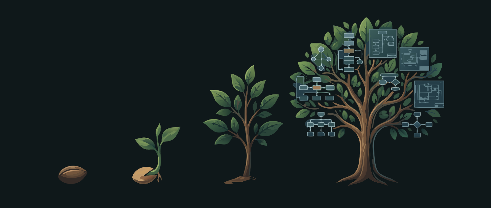
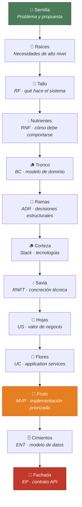

<p align="center">
  
</p>

# 🌱 SeedSpec

### De la semilla al sistema: metodología de expansión documental


---

## Tabla de contenidos

- [🎯 Propósito del repositorio](#-propósito-del-repositorio)
- [🌰 La semilla: punto de partida](#-la-semilla-punto-de-partida)
- [🌿 Fases de crecimiento](#-fases-de-crecimiento)
- [🏷️ Reglas de trazabilidad y nomenclatura](#️-reglas-de-trazabilidad-y-nomenclatura)
- [📋 Orden de generación de artefactos](#-orden-de-generación-de-artefactos)
- [🔬 Decisiones de alcance documental](#-decisiones-de-alcance-documental)
- [🌳 Relación entre artefactos](#-relación-entre-artefactos)
- [📊 Estado actual de la documentación](#-estado-actual-de-la-documentación)
- [🗄️ Materialización: modelo de datos y endpoints](#️-materialización-modelo-de-datos-y-endpoints)
- [📖 Documentación de referencia](#-documentación-de-referencia)
- [🔍 Hallazgos relevantes](#-hallazgos-relevantes)
- [🍎 Cierre del corpus documental](#-cierre-del-corpus-documental)

---

## 🎯 Propósito del repositorio

Este repositorio reúne la base documental del Proyecto **Associated**, un ERP ligero orientado a asociaciones culturales, cofradías, clubes deportivos y peñas festeras españolas. Su objetivo no es solo describir una idea de producto, sino mostrar de forma trazable cómo una **propuesta inicial** — *"la semilla"* — germina y se desarrolla hasta convertirse en un corpus documental completo de especificaciones funcionales, de dominio, arquitectónicas, tecnológicas y operativas.

> [!NOTE]
> En términos metodológicos, el repositorio documenta un proceso de crecimiento orgánico y progresivo:
>
> **Semilla** del problema de negocio → necesidades → requisitos → modelo de dominio → decisiones de arquitectura → stack → concreción técnica → historias de usuario → casos de uso → estrategia de implementación del MVP.

---

## 🌰 La semilla: punto de partida

La construcción de la especificación parte de dos documentos que constituyen la semilla del proyecto:

| Documento | Descripción |
|:----------|:------------|
| [001_propuesta-associated.md](001_propuesta-associated.md) | Formula el problema, el público objetivo, el valor del proyecto y una primera intuición de bounded contexts y eventos de dominio. |
| [002_analisis-necesidades.md](002_analisis-necesidades.md) | Amplía la propuesta mediante un análisis exhaustivo de necesidades reales de colectividades españolas, organizado en secciones temáticas. |

A partir de esos dos insumos, el repositorio cultiva una cadena de artefactos en la que cada documento declara explícitamente sus **inputs** y su **estado**, siguiendo una lógica de crecimiento incremental.

---

## 🌿 Fases de crecimiento

Expansión paso a paso, desde la preparación del terreno hasta la cosecha del MVP.

<details>
<summary><strong>Paso 0 — 🏗️ Preparar el terreno:</strong> delimitación del problema y tesis del proyecto</summary>

La propuesta inicial fija el marco conceptual del Proyecto — el terreno donde crecerá todo lo demás:

- **Dominio:** gestión de colectividades españolas.
- **Problema:** alta carga administrativa sobre perfiles voluntarios.
- **Oportunidad:** ausencia de soluciones asequibles y adaptadas.
- **Enfoque académico:** demostrar DDD, Clean Architecture y decisiones arquitectónicas justificadas, evitando sobreingeniería.

Este documento funciona como **marco de intención**: todavía no define especificaciones, pero planta la semilla de la solución y anticipa conceptos de dominio relevantes.

</details>

<details>
<summary><strong>Paso 1 — 🌱 Primeros brotes:</strong> levantamiento y estructuración de necesidades</summary>

El análisis de necesidades hace germinar la idea inicial en un mapa más concreto de problemas y expectativas. Su función metodológica es doble:

1. **Capturar lenguaje del dominio** desde casos reales o plausibles del contexto español.
2. **Organizar las necesidades por áreas funcionales** para permitir su posterior conversión a requisitos.

De este modo, el documento 002 actúa como raíz primaria para derivar requisitos funcionales y también como soporte para RNFs, porque no solo identifica funcionalidades, sino restricciones operativas, legales y de usabilidad.

</details>

<details>
<summary><strong>Paso 2 — 📝 Formalización:</strong> requisitos funcionales (RF)</summary>

El documento [003_requisitos-funcionales.md](spec/003_requisitos-funcionales.md) deriva de KB-002 y convierte las necesidades en **221 requisitos funcionales** identificados con nomenclatura `NxRFyy`.

Metodológicamente, este paso implica:

- Segmentar el dominio en secciones N2 a N13.
- Expresar cada capacidad como requisito verificable.
- Mantener la semántica del problema original, pero con mayor precisión operativa.

> [!TIP]
> Aquí aparece la primera gran estructura de trazabilidad: las necesidades dejan de ser solo narrativas y echan raíces como **un inventario formal de comportamiento esperado**.

</details>

<details>
<summary><strong>Paso 3 — 🛡️ Derivación:</strong> requisitos no funcionales base (RNF)</summary>

El documento [004_rnf-base.md](spec/004_rnf-base.md) toma como inputs el análisis de necesidades y los requisitos funcionales para identificar **66 requisitos no funcionales agnósticos de tecnología**.

La lógica seguida es separar:

- **Qué debe hacer** el sistema → RF.
- **Cómo debe comportarse** el sistema en términos de seguridad, rendimiento, disponibilidad, RGPD, usabilidad y mantenibilidad → RNF.

Este nivel sigue siendo intencionalmente tecnológico-agnóstico. Todavía no se seleccionan herramientas concretas; se fijan restricciones y metas de calidad.

</details>

<details>
<summary><strong>Paso 4 — 🪵 El tronco:</strong> modelado del dominio y bounded contexts</summary>

El documento [005_modelo-dominio.md](spec/005_modelo-dominio.md) integra la propuesta, el análisis de necesidades, los RF y los RNF base para construir el modelo de dominio — el tronco estructural del que se ramifican las decisiones posteriores.

La metodología de crecimiento en este paso consiste en:

- Identificar subdominios.
- Delimitar bounded contexts.
- Definir aggregates, entities y relaciones entre contextos.
- Explicitar domain events e interacciones.
- Alinear cada bloque del dominio con las secciones funcionales del catálogo RF.

El resultado es una arquitectura conceptual del negocio que ramifica el dominio en **seis bounded contexts principales**:

| Bounded Context | Responsabilidad |
|:----------------|:----------------|
| `BC-Identidad` | Autenticación y gestión de usuarios |
| `BC-Membresia` | Socios, altas, bajas y cuotas |
| `BC-Tesoreria` | Finanzas, cobros y pagos |
| `BC-Eventos` | Actividades y calendario |
| `BC-Comunicacion` | Notificaciones y mensajería |
| `BC-Documentos` | Gestión documental |

Además, los requisitos N8 a N11 se tratan como capacidades **transversales** implementadas sobre los contextos existentes, no como bounded contexts dedicados.

</details>

<details>
<summary><strong>Paso 5 — 🌿 Ramas estructurales:</strong> decisiones de arquitectura (ADRs)</summary>

El documento [006_adrs.md](spec/006_adrs.md) toma como base los RNF y el modelo de dominio para registrar **12 Architectural Decision Records**.

Este paso convierte necesidades y restricciones en decisiones explícitas, justificadas y trazables, por ejemplo: monolito modular, multi-tenant por base de datos separada, módulos por bounded context, domain events in-process, persistencia relacional con PostgreSQL, JWT + refresh tokens, RBAC granular, outbox pattern, Clean Architecture por módulo y API REST + OpenAPI.

> [!IMPORTANT]
> La metodología aquí no consiste en "elegir tecnología porque sí", sino en **documentar por qué cada rama arquitectónica responde a RNFs y al modelo del dominio**.

</details>

<details>
<summary><strong>Paso 6 — ⚙️ Selección:</strong> stack tecnológico</summary>

El documento [007_stack.md](spec/007_stack.md) deriva de los RNF base y de los ADRs. Su función es materializar las decisiones arquitectónicas en un stack concreto.

La secuencia aplicada es deliberada:

1. Primero se establecen restricciones y decisiones.
2. Después se eligen tecnologías coherentes con esas decisiones.

Así, el stack no nace como punto de partida, sino como fruto natural de artefactos previos. El resultado documentado incluye, entre otros, TypeScript, NestJS, React, PostgreSQL, Prisma, MinIO/S3, Vitest, Playwright, GitHub Actions y Sentry.

</details>

<details>
<summary><strong>Paso 7 — 🔩 Concreción:</strong> RNF en requisitos técnicos (RNFT)</summary>

El documento [008_rnf-tecnicos.md](spec/008_rnf-tecnicos.md) conecta los RNF base con el stack seleccionado y traduce los objetivos de calidad en mecanismos técnicos verificables.

Este paso introduce una segunda capa de refinamiento no funcional:

- **RNF-agnóstico** → intención de calidad.
- **RNFT** → implementación técnica, configuración, métricas y verificación.

Por eso el documento incluye una matriz RNF → RNFT → tecnología, consolidando la trazabilidad entre calidad deseada y medios técnicos concretos.

</details>

<details>
<summary><strong>Paso 8 — 🌸 Floración:</strong> User Stories y criterios de aceptación</summary>

El documento [009_user-stories.md](spec/009_user-stories.md) toma como inputs los requisitos funcionales, el modelo de dominio y los RNF técnicos para generar **202 User Stories** con criterios de aceptación.

La metodología observada en este documento consiste en:

- Reorganizar el alcance funcional por bounded context y por áreas transversales.
- Expresar necesidades desde la perspectiva de actores y valor de negocio.
- Incorporar criterios de aceptación en formato verificable.
- Priorizar con MoSCoW.

> [!TIP]
> Este paso hace de puente entre especificación analítica y planificación de producto: es donde el trabajo analítico florece en lenguaje de entrega incremental.

</details>

<details>
<summary><strong>Paso 9 — 🌼 Agrupación cohesiva:</strong> casos de uso y application services</summary>

El documento [010_casos-uso.md](spec/010_casos-uso.md) deriva del modelo de dominio y de las User Stories. Su lógica metodológica es **agrupar historias en casos de uso cohesivos** usando criterios explícitos:

1. Cohesión funcional.
2. Transaccionalidad.
3. Mismo application service.
4. Mismo aggregate.

Cada caso de uso incorpora: metadatos, User Stories agrupadas, bounded context involucrado, application service principal, aggregates participantes, prioridad y complejidad, flujos normales/alternativos/de excepción, domain events e interacciones entre bounded contexts.

En esta etapa el repositorio ya no describe solo "qué necesita el sistema", sino **cómo se ejecuta operativamente cada capacidad relevante**.

</details>

<details>
<summary><strong>Paso 10 — 🍎 La cosecha:</strong> estrategia del MVP</summary>

El repositorio ya incorpora [011_mvp-strategy.md](spec/011_mvp-strategy.md) como artefacto de cierre del ciclo documental principal — el momento de cosechar lo cultivado. Este documento sintetiza KB-003 a KB-010 para seleccionar el subconjunto de casos de uso priorizados, delimitar los bounded contexts incluidos en el MVP y ordenar la implementación en fases con dependencias explícitas.

</details>

<details>
<summary><strong>Paso 11 — 🗄️ Materialización física:</strong> modelo de datos</summary>

El documento [012_modelo-de-datos.md](spec/012_modelo-de-datos.md) traduce los bounded contexts y las decisiones arquitectónicas en un modelo relacional concreto: **40 entidades** distribuidas entre DB-Main (cross-tenant) y DB-Tenant (datos por asociación), con nomenclatura `ENT-XXX`.

Este paso convierte el dominio abstracto en esquema persistible:

- Cada entidad declara su BC propietario, los RNFs que le aplican y los ADRs que la condicionan.
- La organización por base de datos materializa la decisión ADR-002 (multi-tenant por BD separada).
- La trazabilidad ENT → BC + RNF + ADR permite validar que ninguna decisión de dominio o arquitectura queda sin reflejo en el modelo físico.

</details>

<details>
<summary><strong>Paso 12 — 🔌 Contrato público:</strong> inventario de endpoints</summary>

El documento [013_inventario-de-endpoints.md](spec/013_inventario-de-endpoints.md) define los **123 endpoints** del API REST organizados por bounded context, con contratos HTTP, permisos RBAC y trazabilidad bidireccional EP → UC + ENT.

Este artefacto cierra la cadena de materialización:

- Cada endpoint indica el caso de uso que lo origina y las entidades que lee o modifica.
- Los permisos RBAC conectan con ADR-007 y el modelo de roles de BC-Identity.
- El inventario permite validar cobertura: todo caso de uso del MVP tiene sus endpoints definidos.

> [!TIP]
> Con este paso, la cadena de trazabilidad alcanza su máxima concreción: desde la necesidad de negocio (RF) hasta el contrato HTTP público (EP), pasando por dominio, arquitectura, historias y casos de uso.

</details>

---

## 🏷️ Reglas de trazabilidad y nomenclatura

El repositorio sigue una convención explícita de identificadores:

| Tipo de artefacto | Formato | Significado |
|:-------------------|:---------|:------------|
| Requisito funcional | `NxRFyy` | Sección de necesidades + número secuencial |
| Requisito no funcional | `RNF-XXX` | Requisito de calidad agnóstico |
| RNF técnico | `RNFT-XXX` | Concreción tecnológica de un RNF |
| Bounded Context | `BC-Nombre` | Contexto delimitado del dominio |
| ADR | `ADR-XXX` | Decisión arquitectónica registrada |
| User Story | `US-XXX` | Historia de usuario secuencial |
| Caso de uso | `UC-XXX` | Caso de uso secuencial |
| Entidad del modelo de datos | `ENT-XXX` | Entidad relacional del modelo físico |
| Endpoint API | `EP-XXX` | Endpoint REST secuencial |
| Documento base | `KB-XXX` | Entrada del índice de knowledge base |

### Reglas metodológicas observadas

1. Cada documento declara sus **inputs** en la cabecera.
2. Cada documento indica su **estado** y versión.
3. La generación sigue un **orden estricto**, evitando producir artefactos avanzados sin sus predecesores.
4. Las secciones de trazabilidad conectan artefactos entre sí, no solo dentro del mismo documento.
5. La nomenclatura se utiliza como soporte de auditoría documental y no solo como convención estética.

### Estructura general de documentación

De acuerdo con [AGENTS.md](AGENTS.md), los documentos siguen una plantilla común basada en: título, proyecto, versión, fecha, inputs, estado, contenido principal, sección de trazabilidad y changelog.

Esto refuerza el carácter acumulativo y verificable del repositorio.

---

## 📋 Orden de generación de artefactos

La secuencia de crecimiento consolidada en el repositorio es la siguiente:

| # | Artefacto | Documento |
|:-:|:----------|:----------|
| 1 | Propuesta Proyecto | **KB-001** |
| 2 | Análisis de necesidades | **KB-002** |
| 3 | Requisitos funcionales | **KB-003** |
| 4 | RNF base | **KB-004** |
| 5 | Modelo de dominio y bounded contexts | **KB-005** |
| 6 | ADRs | **KB-006** |
| 7 | Stack tecnológico | **KB-007** |
| 8 | RNF técnicos | **KB-008** |
| 9 | User Stories y criterios de aceptación | **KB-009** |
| 10 | Casos de uso / Application Services | **KB-010** |
| 11 | Estrategia de implementación del MVP | **KB-011** |
| 12 | Modelo de datos | **KB-012** |
| 13 | Inventario de endpoints | **KB-013** |

### Relación inputs → outputs

| Transformación | Inputs | Output |
|:---------------|:-------|:-------|
| Necesidades → RF | KB-002 | KB-003 |
| Necesidades + RF → RNF | KB-002, KB-003 | KB-004 |
| Propuesta + necesidades + RF + RNF → Dominio | KB-001 … KB-004 | KB-005 |
| RNF + dominio → ADRs | KB-004, KB-005 | KB-006 |
| RNF + ADR → Stack | KB-004, KB-006 | KB-007 |
| RNF + stack → RNFT | KB-004, KB-007 | KB-008 |
| RF + dominio + RNFT → US | KB-003, KB-005, KB-008 | KB-009 |
| Dominio + US → UC | KB-005, KB-009 | KB-010 |
| Todo el corpus analítico → MVP | KB-003 … KB-010 | KB-011 |
| Dominio + ADR + UC → Modelo de datos | KB-005, KB-006, KB-010 | KB-012 |
| UC + Modelo de datos + ADR → Endpoints | KB-010, KB-012, KB-006 | KB-013 |

---

## 🔬 Decisiones de alcance documental

### Alcance incluido

El scope documental principal comprende **N2 a N11**, equivalentes a **202 RFs**. Según el índice maestro, estas secciones representan el núcleo funcional y transversal del sistema:

| Sección | Área funcional |
|:--------|:---------------|
| N2 | Arquitectura y acceso |
| N3 | Socios y miembros |
| N4 | Tesorería y finanzas |
| N5 | Eventos |
| N6 | Comunicación |
| N7 | Gestión documental |
| N8 | Importación y exportación |
| N9 | Reporting |
| N10 | Portal del socio |
| N11 | Cumplimiento normativo |

### Alcance excluido

Se excluyen del scope documental principal las secciones **N12** y **N13**, que suman **19 RFs**:

- **N12:** funcionalidades específicas por tipo de colectividad.
- **N13:** especificidades del contexto aragonés.

> [!NOTE]
> La exclusión no implica irrelevancia, sino priorización del alcance del Proyecto. En [AGENTS.md](AGENTS.md) se justifican cuatro motivos: complejidad de análisis desproporcionada para el objetivo académico, extensibilidad del modelo garantizada por la arquitectura modular, necesidad de mantener un scope controlable, y delimitación explícita del corpus principal sobre N2–N11 como base suficiente y autocontenida.

---

## 🌳 Relación entre artefactos

La metodología del repositorio puede resumirse como un ciclo de crecimiento orgánico — de la semilla a la cosecha:



### Papel de cada artefacto

| Artefacto | Función |
|:----------|:--------|
| **RF** | Formalizan capacidades funcionales a partir del análisis de necesidades. |
| **RNF** | Fijan restricciones y atributos de calidad del sistema. |
| **BC** | Estructuran el dominio y delimitan responsabilidades. |
| **ADR** | Registran las decisiones de arquitectura derivadas del dominio y los RNF. |
| **RNFT** | Traducen los RNF a mecanismos técnicos medibles sobre el stack. |
| **US** | Expresan valor de negocio y prioridad de entrega. |
| **UC** | Agrupan historias en operaciones ejecutables, asociadas a application services. |
| **ENT** | Materializan bounded contexts en tablas relacionales con trazabilidad a RNF y ADR. |
| **EP** | Definen el contrato HTTP público del API con permisos y trazabilidad a UC y ENT. |

### Relaciones de trazabilidad más relevantes

```
KB-002 → KB-003                          Necesidades → requisitos funcionales
KB-002 + KB-003 → KB-004                 Necesidades y capacidades → restricciones de calidad
KB-001 … KB-004 → KB-005                 Problema + necesidades + requisitos → modelo de dominio
KB-004 + KB-005 → KB-006                 Calidad + dominio → decisiones arquitectónicas
KB-004 + KB-006 → KB-007                 Decisiones + restricciones → selección tecnológica
KB-004 + KB-007 → KB-008                 Requisitos de calidad → implementación técnica
KB-003 + KB-005 + KB-008 → KB-009        Requisitos + dominio + RNFT → historias de usuario
KB-005 + KB-009 → KB-010                 Dominio + historias → casos de uso
KB-005 + KB-006 + KB-010 → KB-012      Dominio + ADR + casos de uso → modelo de datos
KB-010 + KB-012 + KB-006 → KB-013      Casos de uso + modelo de datos + ADR → endpoints API
```

---

## 🗄️ Materialización: modelo de datos y endpoints

Los documentos KB-012 y KB-013 extienden la cadena de trazabilidad desde la especificación funcional hasta la materialización física del sistema:

```
BC (dominio abstracto) → ENT (tabla relacional) → EP (contrato HTTP)
```

| Artefacto | Función |
|:----------|:--------|
| **ENT** | Traducen bounded contexts y aggregates en tablas relacionales con índices, claves foráneas y restricciones. |
| **EP** | Definen el contrato público del API: rutas, métodos HTTP, payloads, permisos RBAC y entidades afectadas. |

La trazabilidad de estos artefactos conecta en tres dimensiones:

- **ENT → BC + RNF + ADR:** cada entidad declara su contexto, restricciones de calidad y decisiones arquitectónicas aplicables.
- **EP → UC + ENT:** cada endpoint indica qué caso de uso implementa y qué entidades manipula.
- **Cobertura:** ~2.459 referencias cruzadas verificables entre los 13 artefactos del corpus.

---

## 📖 Documentación de referencia

Junto a los artefactos documentales, el repositorio incluye tres documentos auxiliares de lectura humana que facilitan la navegación y comprensión del corpus:

| Documento | Propósito |
|:----------|:----------|
| [analisis-documentacion.md](spec/analisis-documentacion.md) | Análisis exhaustivo de la estructura documental: listado de archivos, esquemas de numeración, patrones de cross-referencing y métricas de las ~2.459 referencias cruzadas. |
| [mapa-documentacion.md](spec/mapa-documentacion.md) | Mapa visual del flujo de expansión documental, sistema de codificación, cadenas de trazabilidad con ejemplos concretos y relaciones entre Bounded Contexts. |
| [glosario-traducciones.md](spec/glosario-traducciones.md) | Glosario de traducciones ES → EN para nomenclatura de código fuente: Bounded Contexts, Aggregates, Entities, Value Objects, enums y variables, con convenciones PascalCase / camelCase / UPPER_CASE. |

> [!NOTE]
> Estos archivos no forman parte de la cadena de artefactos documentales (no tienen código KB-XXX ni participan en la trazabilidad formal), sino que actúan como **guías de referencia rápida** para orientarse en el corpus.

---

## 📊 Estado actual de la documentación

La base documental principal se encuentra **completada y cerrada** para el alcance definido.

| Documento | Estado |
|:----------|:------:|
| KB-001 · Propuesta | 📄 Base disponible |
| KB-002 · Análisis de necesidades | 📄 Base disponible |
| KB-003 · RF | ✅ Revisado |
| KB-004 · RNF base | ✅ Revisado |
| KB-005 · Modelo de dominio | ✅ Revisado |
| KB-006 · ADRs | ✅ Revisado |
| KB-007 · Stack | ✅ Revisado |
| KB-008 · RNF técnicos | ✅ Revisado |
| KB-009 · User Stories | ✅ Revisado |
| KB-010 · Casos de uso | ✅ Revisado |
| KB-011 · Estrategia MVP | ✅ Revisado |
| KB-012 · Modelo de datos | ✅ Revisado |
| KB-013 · Inventario de endpoints | ✅ Revisado |

---

## 🔍 Hallazgos relevantes

Durante la reconstrucción metodológica se observa un patrón claro y consistente: **cada artefacto brota como refinamiento controlado del anterior**, no como documento aislado.

El conjunto KB-003 a KB-013 aparece articulado como un recorrido documental completo: requisitos funcionales y no funcionales, modelo de dominio, decisiones arquitectónicas, stack, concreción técnica, historias de usuario, casos de uso, modelo relacional y contrato API mantienen una secuencia de crecimiento continua y explícita.

La incorporación de [011_mvp-strategy.md](011_mvp-strategy.md) cierra el ciclo analítico con una priorización de implementación — el fruto maduro del proceso — apoyada en los artefactos previos. KB-012 y KB-013 completan la cadena de materialización: del dominio abstracto al modelo relacional y al contrato HTTP público, cerrando la trazabilidad desde la necesidad de negocio hasta cada endpoint expuesto.

---

## 🍎 Cierre del corpus documental

Tras la incorporación de los trece artefactos, el repositorio presenta un corpus documental que completó su ciclo de crecimiento para el alcance definido del Proyecto:

- **KB-003 a KB-010** cubren el espectro analítico, funcional, arquitectónico, técnico y operativo del sistema.
- **KB-011** sintetiza ese corpus en una estrategia de implementación del MVP.
- **KB-012 y KB-013** cierran la cadena de materialización: del dominio abstracto al modelo relacional y al contrato HTTP público.
- La **trazabilidad** entre necesidades, requisitos, bounded contexts, decisiones, historias, casos de uso, entidades y endpoints queda expresada de forma explícita y verificable en los documentos del repositorio.

> [!NOTE]
> La semilla plantada en la propuesta inicial ha dado sus frutos: el repositorio completó la **expansión analítica, de diseño, de priorización del MVP y de materialización física** — desde el problema de negocio hasta el último contrato HTTP — dentro del alcance documental establecido.