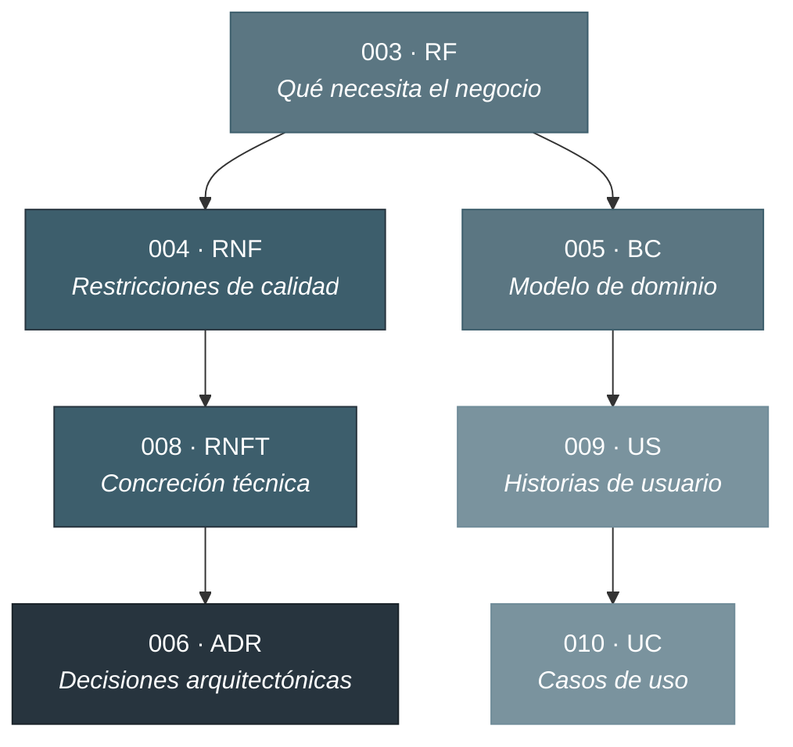
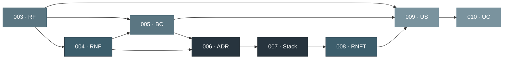
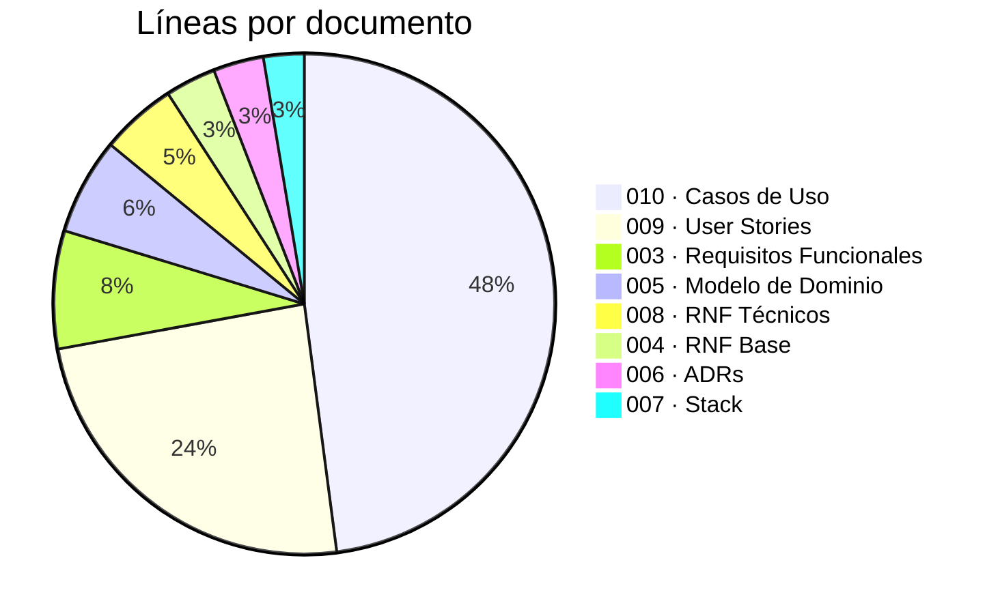

# Especificación - Associated

**221 requisitos · 202 user stories · 77 casos de uso · ~32.600 líneas · ~1.800 referencias cruzadas**

---

## Tabla de contenidos

- [Qué es este directorio](#qué-es-este-directorio)
- [Índice de documentos](#índice-de-documentos)
- [Sistema de codificación](#sistema-de-codificación)
- [Cadena de trazabilidad](#cadena-de-trazabilidad)
- [Mapa de dependencias](#mapa-de-dependencias)
- [Métricas](#métricas)

---

## Qué es este directorio

Aquí vive la especificación completa de Associated. No es un documento monolítico: son 8 documentos de especificación más 3 documentos auxiliares, conectados por ~1.800 referencias cruzadas explícitas que permiten seguir cualquier requisito de negocio desde su origen hasta su caso de uso, pasando por su bounded context, su decisión arquitectónica y su implementación técnica.

Cada documento responde a una pregunta distinta sobre el mismo sistema:

| Documento | Pregunta que responde                     | Perspectiva                  |
| :-------- | :---------------------------------------- | :--------------------------- |
| 003 RF    | **Qué** necesita el negocio               | Necesidad empresarial        |
| 004 RNF   | **Cómo** debe comportarse (restricciones) | Calidad y restricciones      |
| 005 BC    | **Dónde** vive en el dominio              | Estructura DDD               |
| 006 ADR   | **Por qué** se tomó esa decisión          | Justificación arquitectónica |
| 007 Stack | **Con qué** herramientas                  | Tecnologías seleccionadas    |
| 008 RNFT  | **Cómo** se implementa técnicamente       | Implementación concreta      |
| 009 US    | **Quién** hace **qué** y **para qué**     | Flujo de usuario             |
| 010 UC    | **Flujo completo** con eventos y errores  | Especificación ejecutable    |

---

## Índice de documentos

### Documentos de especificación

| #   | Documento                                                     | Contenido                                            | Líneas |
| :-- | :------------------------------------------------------------ | :--------------------------------------------------- | -----: |
| 003 | [Requisitos Funcionales](003_requisitos-funcionales.md)       | 221 RFs organizados en 12 secciones temáticas        |  2.433 |
| 004 | [Requisitos No Funcionales Base](004_rnf-base.md)             | 67 RNFs agnósticos de tecnología                     |  1.046 |
| 005 | [Bounded Contexts y Modelo de Dominio](005_modelo-dominio.md) | 6 BCs con aggregates, entities y value objects (DDD) |  1.991 |
| 006 | [Architectural Decision Records](006_adrs.md)                 | 12 ADRs con contexto, decisión y consecuencias       |  1.038 |
| 007 | [Stack Tecnológico](007_stack.md)                             | Selección y justificación de tecnologías             |    838 |
| 008 | [Requisitos No Funcionales Técnicos](008_rnf-tecnicos.md)     | Concreción técnica de los RNFs (mapeo 1:1)           |  1.565 |
| 009 | [User Stories y Criterios de Aceptación](009_user-stories.md) | 202 US con priorización MoSCoW                       |  7.726 |
| 010 | [Casos de Uso](010_casos-uso.md)                              | 77 UCs con happy path, alternativas y excepciones    | 15.315 |

### Documentos auxiliares

| Documento                                              | Contenido                                                 |
| :----------------------------------------------------- | :-------------------------------------------------------- |
| [Mapa de Documentación](mapa-documentacion.md)         | Flujo de expansión, codificación, trazabilidad y métricas |
| [Análisis de Documentación](analisis-documentacion.md) | Estructura detallada y esquema de numeración              |
| [Glosario de Traducciones](glosario-traducciones.md)   | Mapeo ES→EN para nomenclatura de código fuente            |

---

## Sistema de codificación

Cada elemento tiene un identificador único que permite referenciarlo desde cualquier otro documento:

| Código     | Documento | Formato                                  | Total |
| :--------- | :-------: | :--------------------------------------- | ----: |
| `NxRFyy`   |    003    | N{sección}RF{secuencial} - ej: `N3RF01`  |   221 |
| `RNF-xxx`  |    004    | RNF-{001..066}                           |    66 |
| `BC-Name`  |    005    | BC-{Identity, Membership, Treasury, ...} |     6 |
| `ADR-xxx`  |    006    | ADR-{001..012}                           |    12 |
| `RNFT-xxx` |    008    | RNFT-{001..061}                          |   40+ |
| `US-xxx`   |    009    | US-{001..202}                            |   202 |
| `UC-xxx`   |    010    | UC-{001..076}                            |    76 |

---

## Cadena de trazabilidad

Cualquier requisito se puede seguir desde la necesidad de negocio hasta su especificación ejecutable:



### Ejemplo: Remesas SEPA

```
N4RF17 (Requisito funcional)
  → RNF-018 (Rendimiento operaciones masivas)
    → RNFT-018 (Prisma Batch + Bull Queue)
      → ADR-004 (Integration Events via Outbox)
  → BC-Treasury / Aggregate: SepaRemittance
    → US-047, US-048, US-049 (Tesorero genera remesa SEPA)
      → UC-023 (Generación Remesa SEPA)
```

---

## Mapa de dependencias

El orden en que los documentos se construyen refleja la cadena de dependencias del proceso de especificación:



---

## Métricas

| Métrica                   |                                 Valor |
| :------------------------ | ------------------------------------: |
| Documentos                |                      8 + 3 auxiliares |
| Líneas totales            |                               ~32.600 |
| Requisitos funcionales    |                                   221 |
| Requisitos no funcionales |                                    66 |
| Bounded Contexts          |             6 (3 Core + 3 Supporting) |
| ADRs                      |                                    12 |
| User Stories              | 202 (80 Must · 110 Should · 12 Could) |
| Casos de uso              |                                    76 |
| Referencias cruzadas      |                                ~1.800 |
| Matrices de trazabilidad  |                          5 explícitas |

### Distribución por volumen


